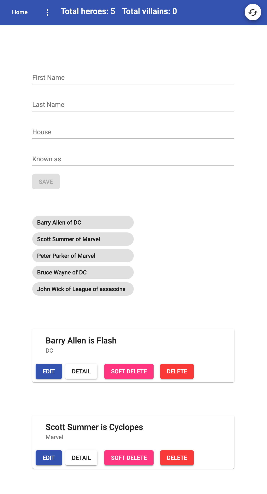

# NgRx Course



## Test

- npm i -D jest @types/jest jest-preset-angular
- remove all jasmine and karma related packages except jasmine-marbles
- remove test property from the angular.json
- remove test.ts jasmine files and karma.conf.js files
- add these for jasmine marbles
- add these below the types attributes of tsconfig.spec.json

```json
    "esModuleInterop": true,
    "emitDecoratorMetadata": true
```

- change test script from ng test to jest
- add this in the package.json

```json
"jest": {
    "preset": "jest-preset-angular",
    "setupFilesAfterEnv": [
      "<rootDir>/setupJest.ts"
    ],
    "testPathIgnorePatterns": [
      "<rootDir>/node_modules/",
      "<rootDir>/dist/"
    ],
    "globals": {
      "ts-jest": {
        "tsConfig": "<rootDir>/tsconfig.spec.json",
        "stringifyContentPathRegex": "\\.html$"
      }
    }
}
```
